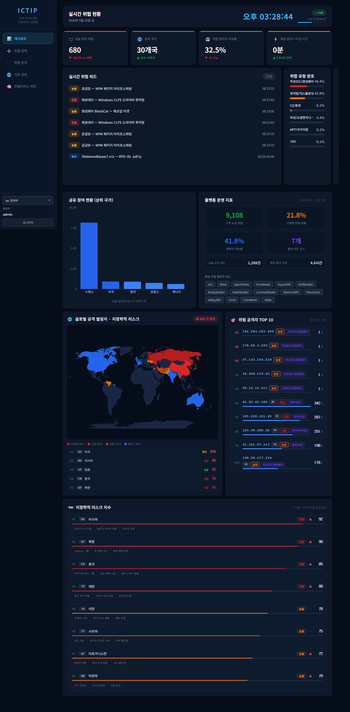
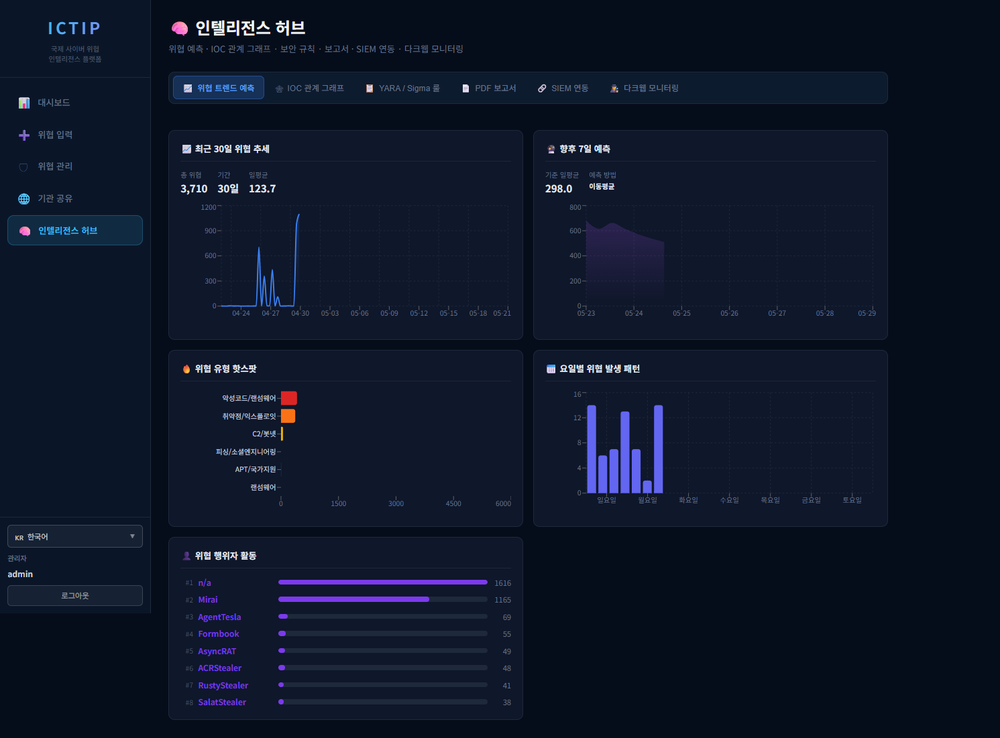
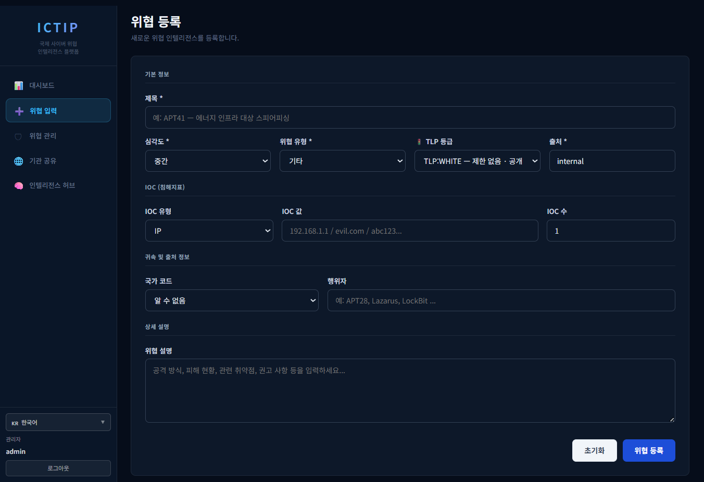
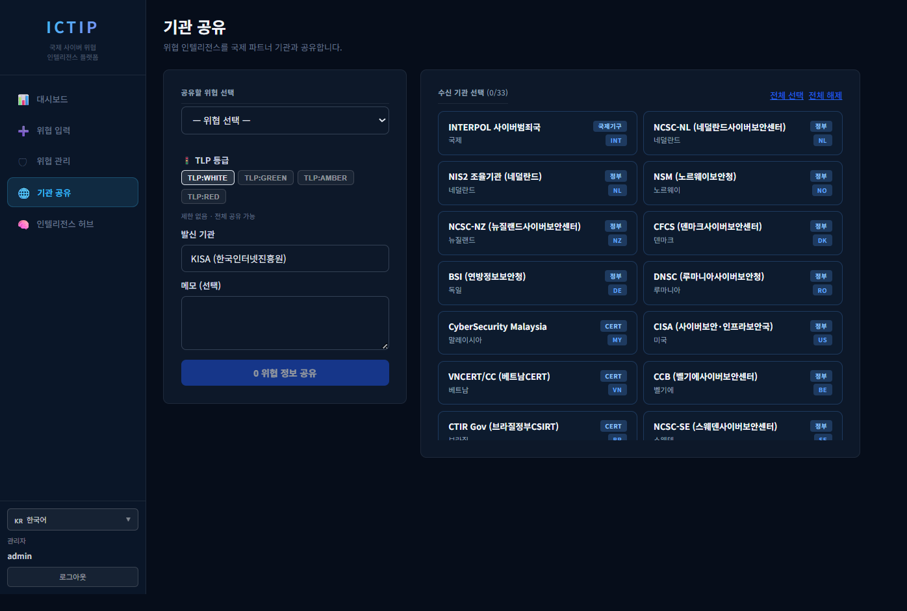
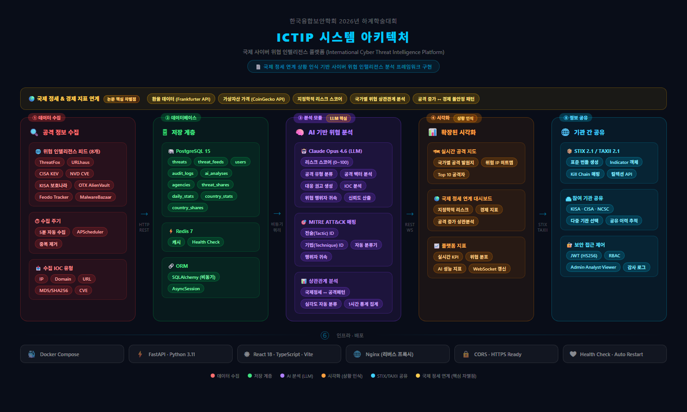

<div align="center">

# 🛡️ ICTIP
### 국제 사이버 위협 인텔리전스 플랫폼
**International Cyber Threat Intelligence Platform**

[](https://python.org)
[](https://fastapi.tiangolo.com)
[](https://react.dev)
[](https://typescriptlang.org)
[](https://docker.com)
[](https://anthropic.com)

</div>

---

## 📌 개요

ICTIP는 국제 사이버 위협 인텔리전스를 **실시간으로 수집·분석·공유**하는 통합 플랫폼입니다.  
8개 글로벌 위협 피드에서 데이터를 자동 수집하고, Claude AI가 각 위협을 심층 분석하며, TLP/STIX/TAXII 표준 기반으로 국제 보안 기관과 위협 정보를 공유합니다.

> 🎓 한양대학교 글로벌 프로젝트 — AI 기반 국제 사이버 위협 정보 공유 및 대응 플랫폼 연구

---

## 🖥️ 주요 화면

### 메인 대시보드
실시간 위협 현황 · 글로벌 공격 지도 · 지정학적 리스크 · 경제 지표 통합 뷰



---

### 인텔리전스 허브 — 위협 트렌드 예측
30일 위협 추세 분석 · 7일 예측 · 위협 유형 핫스팟 · 행위자 활동 현황



---

### 인텔리전스 허브 — IOC 관계 그래프
위협 행위자 · IOC · 캠페인 간 연관 관계 시각화

.png>)

---

### 인텔리전스 허브 — PDF 보고서
일간 위협 요약 · 위협별 상세 보고서 자동 생성

.png>)

---

### 위협 등록
IOC · TLP 등급 · MITRE ATT&CK · 행위자 정보 수동 등록



---

### 위협 관리
9,000+ 건 실시간 수집 피드 · 심각도·유형·소스 필터링

.png>)

---

### 기관 공유
TLP 등급 설정 · 33개 국제 기관 선택 · STIX/TAXII 표준 전송



---

## ✨ 주요 기능

### 🔴 실시간 위협 수집
8개 글로벌 위협 피드를 5분 주기로 자동 수집

| 소스 | 유형 |
|------|------|
| 🦊 ThreatFox | 악성코드 IOC |
| 🔗 URLhaus | 악성 URL |
| 🏛️ CISA KEV | 미국 취약점 경보 |
| 📋 NVD CVE | CVE 취약점 DB |
| 👾 OTX AlienVault | 위협 인텔리전스 |
| 🚦 Feodo Tracker | C2 서버 IP |
| 🦠 MalwareBazaar | 악성코드 샘플 |
| 🇯🇵 JPCERT/CC | 일본 사이버 경보 |

### 🤖 Claude AI 분석 (Tool Use)
- MITRE ATT&CK 전술/기법 자동 분류
- IOC 연관 위협 자동 검색
- CVE 상세 정보 실시간 조회 (NVD API)
- YARA / Sigma 탐지 규칙 자동 생성
- PDF 위협 보고서 자동 생성

### 🌍 국제 기관 간 위협 공유
- **TLP** (Traffic Light Protocol) 4단계 분류
- **STIX 2.1 / TAXII 2.1** 표준 지원
- 30개국 60개 보안 기관 연동

### 📊 분석 대시보드
- 글로벌 공격 발원지 지도
- 지정학적 리스크 패널 (20개국 리스크 스코어링)
- 경제지표(BTC/환율) ↔ 사이버 공격 상관관계 분석
- 실시간 위협 피드 (WebSocket)

### 🌐 다국어 지원
한국어 · English · 日本語 · 中文 (480+ 번역 키)

---

## 🏗️ 시스템 아키텍처



```
┌─────────────────────────────────────────────┐
│              React 18 Frontend              │
│   Dashboard · ThreatMgmt · IntelHub · Share │
└──────────────────┬──────────────────────────┘
                   │ HTTP/WebSocket
┌──────────────────▼──────────────────────────┐
│           FastAPI Backend (Python 3.11)      │
│  14개 라우터 · APScheduler · Claude Tool Use │
└────┬────────────┬────────────┬──────────────┘
     │            │            │
┌────▼───┐  ┌────▼───┐  ┌────▼──────────────┐
│Postgres│  │ Redis  │  │  External APIs     │
│  (DB)  │  │(Cache) │  │ThreatFox·NVD·OTX  │
└────────┘  └────────┘  │CISA·URLhaus·Feodo │
                         └───────────────────┘
```

---

## 🚀 빠른 시작

### 요구사항
- [Docker Desktop](https://www.docker.com/products/docker-desktop/) 설치
- [Git](https://git-scm.com) 설치

### 1. 클론
```bash
git clone https://github.com/zavis-kr/ictip.git
cd ictip
```

### 2. 환경 변수 설정
```bash
cp .env.example .env
```
`.env` 파일을 열어 API 키를 입력합니다:
```env
ANTHROPIC_API_KEY=sk-ant-api03-...   # https://console.anthropic.com
OTX_API_KEY=...                       # https://otx.alienvault.com (선택)
```

### 3. 실행
```bash
docker compose up --build
```

### 4. 접속
| 서비스 | 주소 |
|--------|------|
| 🖥️ 대시보드 | http://localhost:3000 |
| 📡 API 문서 | http://localhost:8000/api/docs |

### 기본 계정
| 역할 | 아이디 | 비밀번호 |
|------|--------|----------|
| 관리자 | `admin` | `Admin1234!` |
| 분석가 | `analyst` | `Analyst1234!` |

---

## 🛠️ 기술 스택

### Frontend
| 기술 | 용도 |
|------|------|
| React 18 + TypeScript | UI 프레임워크 |
| Vite | 빌드 도구 |
| Recharts | 데이터 시각화 |
| react-simple-maps | 공격 지도 |

### Backend
| 기술 | 용도 |
|------|------|
| FastAPI | REST API + WebSocket |
| SQLAlchemy 2 | ORM (비동기) |
| APScheduler | 위협 수집 스케줄러 |
| Anthropic SDK | Claude AI 분석 |

### 인프라
| 기술 | 용도 |
|------|------|
| PostgreSQL 15 | 위협 데이터 저장 |
| Redis 7 | 캐싱 + Pub/Sub |
| Docker Compose | 컨테이너 오케스트레이션 |

---

## 📁 프로젝트 구조

```
ictip/
├── frontend/               # React 18 + TypeScript
│   └── src/
│       ├── pages/          # 5개 페이지 (Dashboard, ThreatMgmt, ...)
│       ├── components/     # 11개 대시보드 패널
│       └── i18n/           # 4개 언어 번역 (480+ 키)
├── backend/                # FastAPI + Python 3.11
│   └── app/
│       ├── routers/        # 14개 API 라우터
│       └── services/       # 8개 위협 피드 수집기
├── docs/screenshots/       # 플랫폼 스크린샷
├── docker-compose.yml
└── .env.example
```

---

## 📄 API 주요 엔드포인트

```
GET  /api/dashboard/stats              KPI 통계
GET  /api/dashboard/attack-map         공격 발원지 맵
GET  /api/dashboard/geo-risk           지정학적 리스크
GET  /api/dashboard/economic-indicators 경제지표
GET  /api/dashboard/correlation        경제↔공격 상관관계
GET  /api/threats                      위협 목록 (페이지네이션)
GET  /api/feeds                        수집 피드 목록
POST /api/threats/{id}/analyze         AI 분석 실행
GET  /api/threats/{id}/analysis        AI 분석 결과
GET  /api/rules/yara/{id}              YARA 룰 생성
GET  /api/rules/sigma/{id}             Sigma 룰 생성
POST /api/threats/{id}/share           기관 간 공유
WS   /ws                               실시간 WebSocket
```

---

## 🔒 보안

- JWT 기반 인증 (admin / analyst / viewer 3단계 권한)
- TLP (Traffic Light Protocol) 기반 정보 분류
- `.env` 파일 Git 제외 (API 키 보호)

---

<div align="center">

**🛡️ ICTIP — 사이버 위협으로부터 안전한 세상을 위해**

</div>
